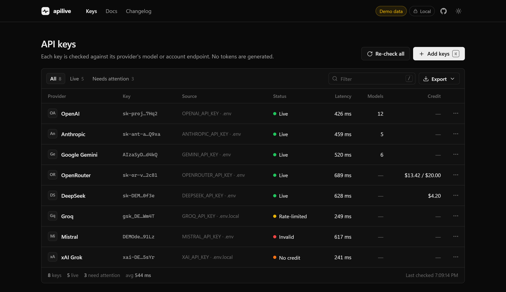

<div align="center">

# apilive

**Are your API keys alive?**

Check LLM API keys for 24 providers in seconds, with latency, models and remaining credit.<br>
It never makes an inference call, so it costs **zero tokens**. It runs on your machine and has **zero dependencies**.

[](https://www.npmjs.com/package/apilive)
[](https://github.com/parthksingh1/apilive/actions/workflows/ci.yml)


[](LICENSE)

```bash
npx apilive
```



</div>

---

## Why

You have keys scattered across `.env` files, old projects and password managers. Some are revoked, some are out of credit, and you can't tell which without writing a curl command for each provider.

Online key checkers want you to paste secrets into someone else's website. **apilive runs on your own machine.** Every key goes straight to its own provider's official API and nowhere else.

## Features

- **24 providers**: OpenAI, Anthropic, Gemini, Groq, Mistral, OpenRouter, DeepSeek, xAI, Together, Cohere, Kimi, Qwen, GLM/Z.ai, SiliconFlow, Perplexity, Cerebras, Fireworks, SambaNova, Hugging Face, Replicate, Novita, DeepInfra, Hyperbolic and Nebius.
- **Zero cost.** It only calls model-list, account and balance endpoints. It never generates a token.
- **Finds your keys.** It scans `.env`, `.env.local`, `.env.production`… and your shell environment.
- **Auto-detects the provider** from the key format (`sk-ant-`, `gsk_`, `AIza…`) or the variable name.
- **More than "valid or not".** Each key is reported as `live`, `invalid`, `no credit`, `rate-limited` or `unverified`.
- **Shows what the key can do**: latency, available models, and remaining **credit** for OpenRouter, DeepSeek, Kimi, SiliconFlow and Novita.
- **Paste a whole `.env` file.** It picks out every key, skips placeholders and removes duplicates.
- **CI-ready CLI** with exit codes and `--json`.
- **Exports** a Markdown or JSON report with keys masked.

## Usage

### Web UI

```bash
npx apilive
```

This opens `http://127.0.0.1:4577`. Any keys found in the current directory's `.env*` files or in your environment are listed but **not sent anywhere until you click Check**. You can also paste one key or an entire `.env` file.

### Terminal

```bash
npx apilive check                      # scan ./.env* + environment
npx apilive check .env.production      # specific files
npx apilive check --no-env             # only .env files, ignore shell env
pbpaste | npx apilive check --stdin    # from clipboard, stays out of shell history
npx apilive check --json               # machine-readable
npx apilive providers                  # list providers + env var names
```

```text
  apilive v1.1.0  ·  checking 4 keys  · free endpoints only, no credits spent

  ✓ OpenAI      sk-proj…7Hq2   live · 412ms · 87 models · 4999 req remaining
                OPENAI_API_KEY · .env
  ✓ OpenRouter  sk-or-v…2c81   live · 390ms · $13.42 / $20.00
                OPENROUTER_API_KEY · .env
  ~ Groq        gsk_DE…Wm4T    rate-limited · 305ms
                GROQ_API_KEY · .env.local
  ✗ Mistral     DEMOde…91Lz    invalid · 604ms · Unauthorized
                MISTRAL_API_KEY · .env

  2 live  ·  1 rate-limited  ·  1 invalid  ·  1.1s  ·  0 tokens spent
```

**Exit codes:** `0` all keys live (or only rate-limited) · `1` a key is invalid, out of credit, or unverifiable · `2` no keys found or bad usage.

### In CI

```yaml
# .github/workflows/keys.yml — nightly check that production keys still work
on:
  schedule: [{ cron: "0 6 * * *" }]
jobs:
  keys:
    runs-on: ubuntu-latest
    steps:
      - run: npx -y apilive@1 check   # pin the major version in CI
        env:
          OPENAI_API_KEY: ${{ secrets.OPENAI_API_KEY }}
          ANTHROPIC_API_KEY: ${{ secrets.ANTHROPIC_API_KEY }}
```

### Options

| Flag | Description |
|---|---|
| `--port <n>` | UI port (default `4577`, falls back to the next free port) |
| `--no-open` | Don't open the browser |
| `--no-env` | Ignore environment variables; only read `.env` files |
| `--stdin` | Read keys or `.env` text from stdin |
| `-p, --provider <id>` | Treat keys from stdin as this provider |
| `--json` | JSON output for `check` |
| `--models` | Print each key's model list |
| `--timeout <sec>` | Per-request timeout (default `15`) |
| `--concurrency <n>` | Parallel checks (default `6`) |
| `--demo` | UI with sample keys and simulated responses, for screenshots |
| `--no-update-check` | Don't check npm for a newer version |

Other commands: `apilive update` (update in place), `apilive privacy`, `apilive terms`. The [Guide](docs/GUIDE.md) has the full reference, troubleshooting and FAQ.

## Updating

apilive checks the npm registry for a newer version at most once a day and tells you in the terminal and the app. It **never installs anything by itself**.

| How you run it | How to update |
|---|---|
| `npx apilive` | `npx apilive@latest` |
| Global install | `apilive update` (asks, then runs `npm install -g apilive@latest`) |

The check sends one anonymous request to `registry.npmjs.org`, with no keys and no usage data. Turn it off with `--no-update-check`, `NO_UPDATE_NOTIFIER=1` or `DO_NOT_TRACK=1`. It's skipped in CI. Release notes are in the [Changelog](CHANGELOG.md). Releases are published from GitHub Actions with [npm provenance](https://docs.npmjs.com/generating-provenance-statements/), so you can verify with `npm audit signatures` that the package was built from this repository.

## How it stays free

Each provider is checked with an endpoint that **authenticates the key but runs no model**:

| Endpoint type | Providers |
|---|---|
| `GET /models` | OpenAI, Anthropic, Gemini, Groq, Mistral, xAI, Together, Cohere, Kimi, Qwen, GLM, SiliconFlow, Perplexity, Cerebras, Fireworks, DeepInfra, Hyperbolic, Nebius |
| Account / balance | OpenRouter `/key`, DeepSeek `/user/balance`, Novita `/billing/balance`, Hugging Face `/whoami-v2`, Replicate `/account` |
| Validation-error probe | SambaNova: an embeddings request with no input, rejected before anything runs |

Some providers (Novita, SambaNova, Nvidia, OpenRouter) serve their model list **without authentication**. A naive checker would report *any* string as a working key for them. apilive avoids those endpoints, and `npm run verify` sends a fake key to every provider to prove each one rejects it:

```text
$ npm run verify
ok    openai       invalid   401  Incorrect API key provided
ok    anthropic    invalid   401  API key is invalid.
ok    gemini       invalid   400  API key not valid.
…
No provider accepted a fake key.
```

> "Live" means the provider authenticated the key. Providers such as OpenAI don't expose credit balance through the API, so a live key can still hit a quota limit on its first real request.

## Security model

apilive handles secrets, so it's built to be easy to audit:

- **No dependencies.** It uses only Node's built-in `http` and `fetch`. The whole backend is about 1,400 lines of plain JavaScript.
- **Loopback only.** The server binds to `127.0.0.1` and is unreachable from your network.
- **DNS-rebinding protection.** Requests whose `Host` isn't `127.0.0.1` or `localhost` on the right port are rejected.
- **Per-session token.** Every API call needs a random token embedded in the page. Other websites can't read it, so they can't drive the local API.
- **Strict CSP.** `default-src 'none'` with no third-party scripts, fonts or analytics. The page talks only to `127.0.0.1`.
- **Keys never reach the browser.** The UI receives masked keys (`sk-proj…7Hq2`) and opaque refs. Raw keys stay in server memory and are dropped when you press Ctrl+C.
- **One key, one destination.** An ambiguous `sk-…` key is **never** tried against several providers, because that would leak it to the wrong companies. You pick the provider instead.
- **Nothing logged, no telemetry.** Keys are never written to disk. The only file apilive writes is a tiny `state.json` holding the update-check time and whether you've seen the first-run notice. Provider error messages are scrubbed so a key is never echoed back.
- **Built for your own keys.** There's a limit of 100 keys per session and a first-run notice that you may only check keys you're authorized to use.

See [SECURITY.md](SECURITY.md) to report a vulnerability.

## Add a provider

Providers live in [`src/providers.js`](src/providers.js). Most OpenAI-compatible APIs take six lines:

```js
{
  id: "acme",
  name: "Acme AI",
  mark: "Ac",
  keyUrl: "https://acme.ai/keys",
  env: ["ACME_API_KEY"],
  pattern: /^acme-\w{20,}$/,           // optional: unique key format
  regions: ["https://api.acme.ai/v1"],
  ...openAICompatible(),
},
```

Then run `npm run verify` to confirm the endpoint rejects fake keys, and `npm test`.

## Development

```bash
git clone https://github.com/parthksingh1/apilive && cd apilive
npm start            # UI (no install step, since there are no dependencies)
npm run check        # CLI
npm test             # unit + server security tests
npm run verify       # live fake-key check against every provider
```

